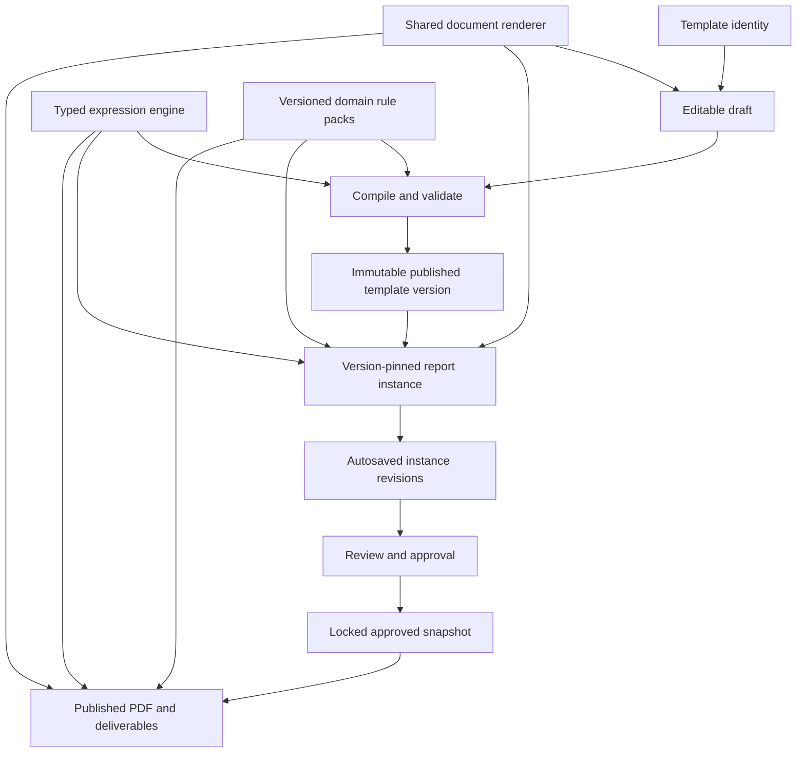

# Custom Report Builder: Full Report Parity Plan

**Route:** `/custom-forms/templates`  
**Audience:** product owner, developers, and AI coding agents  
**Document status:** implementation source of truth  
**Last static audit:** September 8, 2026  
**Live production database checked:** no (schema verified against the pg_dump in `database/bootstrap/02_schema.sql`)  
**Last progress update:** September 8, 2026

---

## Progress

| Phase | State | Notes |
|---|---|---|
| 0 — Protect data and define the contract | **Done**, pending smoke test | Migration written and applied. Version store, pinning, revisions, `LIMITED SERVICE`, compiler and fixtures all landed. |
| 1 — Build one shared runtime | **Done** | Four renderers collapsed into one. Render harness now proves the modes agree. |
| 2 — Complete document and table schema | **Mostly done** | Schema, runtime, validation and the table grid editor landed. Layout containers and bindings still have no authoring UI. |
| 3 — Typed expression and rule engine | **In progress: core library** | Safe parser, typed evaluation, stable-reference upgrade helper, dependency checks and regression tests landed. Not activated in the report runtime or publication path. |
| 4 — Repeaters, comparisons, charts, signatures | Not started | Signature capture is stubbed; the schema slot exists. |
| 5 — Operational workflow | Not started | `workflow_status` column exists from phase 0; nothing reads it yet. |
| 6 — Convert and certify the report catalogue | **Started** | Matrix of all 59 reports built; 3 in progress, 0 certified. Low Voltage Switch is the first hand-built conversion. |

### Where the work actually stands

**Tables can now be authored in V2.** The grid editor draws the real table and
you click cells in it to merge and split; the section carries a `v2` overlay
beside its V1 shape, so conversion is per-section and reversible. Formulas are
written with a searchable reference picker instead of remembered syntax.

**Still not authorable:** layout containers (side-by-side, grid, callout,
keep-together, page break) and declarative bindings. Both are supported by the
schema and the renderer; neither has UI. They need a block-tree editor rather
than a section-level one.

**One real report has been rebuilt end to end.** 3-Low Voltage Cable MTS
reproduces against the hard-coded original on 30 checked properties, and the
exercise found and closed a genuine schema gap (records that span more than one
row). See the conversion pilot note under Phase 2.

The next step is either a second report, to see whether the first was
representative, or the block-tree editor for layout containers.

### Verification available today

- `node --import ./scripts/ts-alias-loader.mjs scripts/custom-forms-regression.ts`
  (also `npm run custom-forms-regression`) runs 455 checks: adapter fidelity,
  row identity, grids, conditions, bindings, the typed expression engine, and
  **the rendered output of every fixture in every mode**. It needs no database
  and no test framework.
- Rendering is checked by `scripts/custom-forms-render.tsx`, which renders the
  real runtime through `react-dom/server`. No DOM, no browser, no framework:
  `scripts/ts-alias-loader.mjs` transforms TSX with sucrase, already a
  dependency. This is the harness the two "renders the same in every mode"
  gates were waiting on.
- There is still **no PDF test**. Phase 2's print-path gate needs the
  production PDF pipeline, not a headless render.

### Bugs the render harness caught

Both were introduced by the phase 2 renderer rewiring, both were invisible to
the data-layer tests, and both would have reached a technician.

1. **Table cells rendered blank and saved to the wrong key.** A V1 column
   carries a column id (`col-test`) and a separate field id (`test`); the
   instance is keyed by the field. The V2 renderer used the column id for both,
   so every table cell in every existing custom form rendered empty, and any
   edit would have written to a key nothing reads. `ColumnV2.fieldId` now keeps
   the grid identity and the data key apart.
2. **A conditional table showed no rows until someone touched its dropdown.**
   Conditions were evaluated against raw instance values, and a form nobody has
   opened yet holds no setting value at all, so every conditional row evaluated
   to hidden. `conditionScopeValues` folds each section's declared defaults into
   the scope before any condition runs.

### Print

A section heading stranded alone at the foot of a page was the most visible
print defect in the second conversion. The rule, the heading and the start of
the body now carry `break-after: avoid`, so a title cannot be separated from
what it titles.

### Outstanding risks

1. ~~The renderer was rewired twice with no rendered-output test.~~ **Closed.**
   The render harness covers it and caught two real bugs the data-layer tests
   could not see (below). **A manual smoke test against the running app passed
   on 9 September 2026: forms load and are fillable.**
2. **Backfilled template versions carry the current draft**, not the structure
   instances were actually filled against. Templates edited in place before the
   migration cannot have their history reconstructed. Those rows are marked
   `origin = 'imported'`.
3. **Mid-table row deletion still re-associates row ids by position.** Values
   stay correct against what the user sees. Closing this means moving the
   renderer to id-addressed rows, which phase 2 laid the groundwork for but did
   not switch on.

---

## 1. Goal

Make the Custom Report Builder capable of replacing every hard-coded report in
`src/components/reports/` without losing:

- report fields or table structure;
- calculation and tolerance logic;
- visual meaning and print layout;
- job, customer, asset, and equipment connections;
- autosave and recovery;
- review, approval, and publishing behavior;
- PDF, deliverable, and customer-portal support;
- signatures and attestations;
- historical accuracy after a template changes.

The end state is not merely “the builder can draw the report.” The end state is:

> A non-developer can build, publish, fill, review, approve, and deliver any supported report without adding a new hard-coded React report, while old reports remain unchanged and auditable forever.

---

## 2. Executive decision

### Can the current builder rebuild every report?

**No.** It can reproduce useful parts of many reports, but it is not yet safe or complete enough to replace the hard-coded report system.

*Updated after phase 2:* the runtime and schema can now represent the reports.
The builder still cannot author them, so the answer above is unchanged in
practice. See the Progress section at the top.

### Can it be made capable?

**Yes.** The recommended solution is to turn it into a **versioned report engine** with:

1. immutable template versions;
2. one shared renderer;
3. a complete document and table schema;
4. a typed calculation and rule engine;
5. reusable special structures such as repeaters, charts, and signatures;
6. full lifecycle integration for autosave, approval, PDF publishing, and deliverables;
7. a certification process for all existing reports.

The builder should use generic no-code primitives for normal layout and a small set of safe, versioned **domain rule packs** for complex electrical and safety rules. Templates must never execute arbitrary JavaScript.

---

## 3. What “parity” means

A converted report is not complete until it passes all five levels below.

| Level | Requirement |
|---|---|
| 1. Structural parity | All headings, fields, tables, merged cells, repeated blocks, choices, and signatures can be represented. |
| 2. Behavioral parity | Calculations, lookups, interpolation, tolerance checks, conditional visibility, and validation behave the same way. |
| 3. Data parity | Saved values retain stable meaning across edits, reloads, template releases, and historical viewing. |
| 4. Output parity | Fill mode, print preview, production PDF, deliverables, and portal output preserve the report’s intended layout and meaning. |
| 5. Workflow parity | Autosave, review, approval, locking, amendments, publishing, authorization, and audit history work end to end. |

A report that only looks similar in the builder preview has **not** reached parity.

Pixel-for-pixel replication is not required where it adds no business value, but the following are required:

- no missing data;
- no changed calculation results;
- no ambiguous units;
- no lost signatures or approvals;
- no misleading table grouping;
- no broken page layout;
- no change to a historical report caused by a later template edit.

---

## 4. Verified report inventory

The static repository audit found:

- **59 unique routed report implementations**;
- **63 route slugs**, because aliases and substation routes share implementations;
- **65 top-level `.tsx` or `.jsx` report files**: 59 report implementations plus 6 support files;
- **47 of 59** implementations containing `colSpan` or `rowSpan`;
- **44 of 59** using header spans;
- **39 of 59** using multi-row `<thead>` structures;
- at least **22** using merged cells in table bodies;
- **11** using radio-button layouts;
- **5** chart-related implementations:
  - `GroundingFallOfPotentialSlopeMethodTest.tsx`;
  - `TanDeltaChart.tsx`;
  - `TanDeltaChartMTS.tsx`;
  - `TanDeltaTestMTSForm.tsx`;
  - `MediumVoltageCableVLFTest.jsx`;
- actual rendered signature inputs in:
  - `JobHazardAnalysisForm.tsx`;
  - `EnergizedWorkPermitForm.tsx`.

Some VLF report files define signature-related data properties but do not render signature inputs. Those unused properties must not be counted as an existing signature requirement without further product confirmation.

These counts describe the current repository. The final migration phase must create a report-by-report certification matrix rather than relying only on search counts.

---

## 5. Current builder capabilities

The current system already provides useful foundations:

- template creation and editing;
- reusable section presets from `src/lib/customForms/componentLibrary.ts`;
- job information and temperature correction factor support;
- nameplate and equipment data sections;
- visual and mechanical inspection sections;
- flat data tables;
- basic arithmetic formulas;
- test-equipment selection and calibration lookup;
- comments and photos;
- creation of an asset record for a custom-form instance;
- normal screen and print-oriented rendering paths.

The existing `3-LowVoltageCableATS` custom template is evidence that wide flat tables, normal report fields, and basic TCF calculations are possible.

However, these foundations should not be described as complete lifecycle support. In particular:

- the filler does not currently provide reliable autosave;
- custom-form assets are excluded from important approval and deliverable paths;
- the production PDF publisher rejects custom forms;
- approved custom forms remain editable;
- existing instances are not pinned to immutable template versions;
- runtime-added table rows are not structurally durable after reload.

No hard-coded report route should be retired until those issues are resolved.

---

## 6. Critical current defects

These are production-safety issues, not optional enhancements.

### 6.1 Historical instances depend on a mutable template

Templates are updated in place. Existing instances load the current template rather than the exact template version used when the report was created.

**Impact:** changing a template can alter, hide, reinterpret, or break historical reports.

Relevant files:

- `src/components/customForms/FormBuilder.tsx`;
- `src/components/customForms/CustomFormFiller.tsx`;
- `database/migrations/create_custom_forms_tables.sql`;
- `database/bootstrap/02_schema.sql`.

### 6.2 Added rows are not saved as durable structure

The filler can mutate row counts and conditional rows in local memory, but the save payload mainly stores values. The changed runtime structure is not reliably reconstructed after reload.

**Impact:** a report can appear saved and then reopen with missing or misaligned rows.

### 6.3 Four renderers have drifted apart

Document and table behavior is independently implemented in:

1. `src/components/customForms/FormCanvas.tsx`;
2. `src/components/customForms/FormPreview.tsx`;
3. `src/pages/CustomFormPreview.tsx`;
4. `src/components/customForms/CustomFormFiller.tsx`.

Known differences include calculations, equipment lookup, conditional behavior, `showInPrint`, and print layout.

**Impact:** a template can look correct in one mode and behave differently when filled or printed.

### 6.4 Validation is mostly descriptive

The schema declares options such as `required`, minimum, maximum, pattern, and `customRule`, but instance save does not consistently enforce them. Publishing a template does not run a complete compile and validation gate.

**Impact:** invalid templates and invalid report data can reach production workflows.

### 6.5 The formula evaluator is incomplete and fragile

The current evaluator supports limited numeric arithmetic and `round()`. It also has unsafe or misleading behavior:

- missing and non-numeric references can become `0`;
- formula errors can render as blank output;
- calculated cells cannot reliably depend on other calculated cells;
- positional references such as `{REF.C5}` can change meaning after columns move;
- there is no dependency graph or cycle detection;
- text and boolean results are not supported;
- the implementation relies on expression rewriting and `new Function` rather than a typed parser.

### 6.6 Declared settings are not consistently honored

Settings such as these are initialized but not fully consumed by the runtime:

- `includePassFail`;
- `includeJobInfo`;
- `includePrintHeader`;
- `pageBreakAfterSection`.

`showInPrint` is honored in a preview path but ignored by the actual filler path.

### 6.7 `LIMITED SERVICE` may fail to save

The UI offers `PASS`, `FAIL`, and `LIMITED SERVICE`, while the checked schema and shared type only allow `PASS` and `FAIL`.

The live production database was not inspected and may contain an untracked manual correction. The migration must inspect and safely normalize the actual constraint rather than assuming production matches the repository.

### 6.8 Custom forms are not fully connected to report operations

Custom forms can create assets using a `custom-form:` identifier, but several systems only recognize normal `report:` assets.

Affected areas include:

- report status and approval-record creation;
- approval queues and metrics;
- production PDF publishing;
- job deliverables;
- customer-facing or portal delivery paths;
- bulk publishing and bulk printing;
- approved-report edit locking.

Relevant files include:

- `src/lib/services/assetReportStatus.ts`;
- `src/components/reports/ReportApprovalWorkflow.tsx`;
- `supabase/functions/publish-report-pdf/index.ts`;
- `src/components/jobs/JobDeliverables.tsx`;
- `src/components/reports/ReportWrapper.tsx`.

---

## 7. Target architecture



### 7.1 Main layers

| Layer | Responsibility |
|---|---|
| Template workspace | Lets a user edit a draft without affecting published versions or existing reports. |
| Template compiler | Normalizes defaults and rejects invalid layouts, references, formulas, rules, and settings. |
| Immutable template version | Stores the exact published schema, settings, lookup data, and rule-pack versions. |
| Instance runtime state | Stores values plus durable row, repeater, and conditional structure using stable IDs. |
| Shared renderer | Renders the same document definition in canvas, preview, fill, read-only, and print modes. |
| Expression and rule engine | Evaluates safe typed expressions and approved domain-specific rules consistently on client and server. |
| Workflow services | Handle autosave, conflicts, review, approval, locking, PDF publishing, and deliverables. |
| Certification layer | Maps existing report routes to approved template versions after parity tests pass. |

### 7.2 Non-negotiable architecture rules

1. **Published versions are immutable.** Editing creates a new version; it never mutates an old one.
2. **Every instance is version-pinned.** An instance never loads “whatever the template looks like today.”
3. **Every referencable item has a stable ID.** Calculations and data cannot depend on array position or visible labels.
4. **One renderer owns document behavior.** Page components may load and save data, but may not independently recreate report markup.
5. **No arbitrary JavaScript in templates.** Use a typed parser and whitelisted functions or versioned domain rules.
6. **The same logic runs everywhere.** Fill mode, server validation, approval, and PDF output must agree.
7. **Missing data is not zero.** Unknown, empty, invalid, and calculated values must remain distinguishable.
8. **Errors are visible.** Formula, validation, lookup, and layout failures may not silently become blank output.
9. **Approval freezes the record.** Changes after approval require an explicit amendment or new revision.
10. **Generated templates are drafts.** AI output must pass the same compiler and human review as manually built templates.

---

## 8. Versioned data model

The exact SQL should be designed against the current schema before implementation, but it must satisfy the following contract.

### 8.1 Template identity and draft workspace

`custom_form_templates` should represent the durable identity and editable workspace for a report template. It may contain:

- template ID and human-readable name;
- canonical report type or slug;
- draft structure and draft settings;
- active published version ID;
- owner and access metadata;
- archived state;
- created and updated audit fields.

The draft is allowed to change because instances must never depend directly on it.

### 8.2 Immutable template versions

Add a table such as `custom_form_template_versions` containing a complete, immutable published snapshot:

- version ID;
- template ID;
- monotonically increasing version number;
- schema version, beginning with V1/V2 distinction;
- compiled structure;
- compiled settings;
- embedded or referenced lookup tables;
- exact domain rule-pack names and versions;
- expression-engine version if needed for reproducibility;
- content checksum;
- release notes;
- creator and creation timestamp;
- publisher and publication timestamp.

After publication, application code and database policy must prevent updates to the version payload.

### 8.3 Version-pinned instances

Every `custom_form_instance` must store:

- `template_id` for convenient grouping;
- required `template_version_id` for authoritative rendering;
- schema version;
- user-entered data;
- durable runtime structure or repeater state;
- a revision number for optimistic concurrency;
- result status separate from workflow status;
- creation and update audit fields.

A defensive template checksum or snapshot may also be stored with the instance. It is not a replacement for a proper version table, but it can help detect corruption and preserve records during migrations.

### 8.4 Durable V2 instance structure

Runtime-added items must be stored by identity, not inferred from the latest row count. A V2 state should conceptually include:

```ts
interface CustomFormInstanceStateV2 {
  values: Record<string, unknown>;
  tableRows: Record<
    string,
    Array<{
      rowInstanceId: string;
      rowDefinitionId: string;
      order: number;
    }>
  >;
  repeaters: Record<
    string,
    Array<{
      groupInstanceId: string;
      order: number;
      label?: string;
    }>
  >;
  uiState?: Record<string, unknown>;
}
```

This is a contract example, not final copy-and-paste code. The final design must account for current saved V1 data before types or migrations are committed.

Rules:

- IDs are created once and persisted;
- IDs are never regenerated during render;
- deleting a row must not shift the identity of later rows;
- values must be keyed by field, row, column, and repeater instance IDs;
- conditional visibility must not delete hidden values unless a rule explicitly requests it;
- print-only UI state must not pollute business data.

### 8.5 Status separation

Do not overload a single `status` value with unrelated meanings.

Recommended concepts:

- **result status:** unset, pass, fail, limited service, not applicable, or another explicitly supported result;
- **workflow status:** draft, ready for review, in review, changes requested, approved;
- **publication status:** unpublished, publishing, published, failed;
- **authorization:** derived from the user, company, job, role, and approval assignment rather than saved as a display status.

Compatibility columns may remain during migration, but new code should use explicit concepts.

### 8.6 Migration requirements

The migration must be additive and reversible where practical.

1. Create version storage and new instance columns.
2. Create one legacy imported version for each existing template needed by an instance.
3. Pin existing instances to the best available snapshot.
4. Record that historical template states from before the migration cannot be reconstructed if the template was already changed in place.
5. Add stable IDs to imported structures once and persist them.
6. Preserve a V1 adapter while V1 instances remain.
7. Widen the result-status constraint to support `LIMITED SERVICE` consistently.
8. Update both migrations and bootstrap schema files according to repository conventions.
9. Add database constraints preventing mutation of published version payloads.
10. Require a version ID for newly created instances after backfill succeeds.

Do not silently rewrite all historical instance data into V2 in one destructive operation. Read V1 through a compatibility adapter, then migrate deliberately with fixtures and audit output.

---

## 9. Shared document runtime

Create one reusable report document renderer. Working name:

`CustomReportDocumentRenderer`

It should accept a compiled template, instance state, runtime mode, and callbacks. It should not fetch database records itself.

### 9.1 Required modes

- `canvas`: builder selection, drag/drop, and editing decorations;
- `preview`: realistic draft preview without saved instance behavior;
- `fill`: editable production instance;
- `readOnly`: historical, approved, or permission-restricted view;
- `print`: deterministic output for browser print and production PDF.

### 9.2 Renderer responsibilities

- resolve sections and layout containers;
- resolve declarative data bindings;
- render fields, tables, charts, and signatures;
- apply visibility and read-only rules;
- show validation and calculation errors appropriately for the mode;
- apply dark-mode screen styles;
- apply comprehensive, scoped print styles;
- honor all published settings;
- preserve square-corner UI styling used by this project;
- use stable IDs for all value and calculation paths.

### 9.3 Shell responsibilities

The existing pages and components should become thin shells:

- load the template version and instance;
- load job/customer/asset/equipment context;
- handle permissions;
- pass data to the renderer;
- save through a shared service;
- navigate and display workflow actions.

They must not maintain separate switches that reimplement each section type.

### 9.4 Extraction rule

Do not start by extracting only table markup. Extract the complete document behavior because current drift also affects:

- calculations;
- data population;
- equipment lookup;
- visibility;
- `showInPrint`;
- conditional behavior;
- read-only behavior;
- print layout.

A temporary compatibility layer may translate V1 sections into renderer nodes. Existing templates must continue to open during the extraction.

---

## 10. Document schema V2

Schema V2 must model the reports that exist, not only the easiest flat tables.

### 10.1 Stable identity

Every one of the following requires a stable ID:

- section;
- layout container;
- field;
- table;
- column;
- header, body, and footer row definition;
- merged cell;
- lookup table;
- chart and series;
- repeater group;
- rule;
- signature role.

Visible labels may change without changing data identity.

### 10.2 Complete table model

The table model must support:

- multiple header rows;
- header `rowSpan` and `colSpan`;
- body `rowSpan` and `colSpan`;
- footer rows and merged footer cells;
- fixed test matrices;
- normal repeated-record rows;
- heterogeneous row types in one table;
- divider, note, criteria, label, subtotal, and total rows;
- conditional headers, rows, columns, and cells;
- editable, populated, calculated, display-only, and lookup cells;
- table-level and column-level units;
- repeated headers after print page breaks;
- stable row and column IDs;
- controlled row insertion, deletion, reordering, and copying;
- per-cell alignment, emphasis, result styling, and print behavior.

A flat `columns[]` array plus one `headerRows` property is not enough. The schema needs a validated grid covering header, body, and footer regions.

### 10.3 Layout containers

Add generic layout primitives for:

- full-width stacks;
- two-column and configurable grid layouts;
- side-by-side tables or sections;
- bordered information strips;
- callouts and criteria notes;
- keep-together blocks;
- explicit print page boundaries.

Responsive screen behavior and print behavior must be independently configurable where necessary.

### 10.4 Fields and controls

The field system must support:

- text and multiline text;
- number and formatted number;
- date, time, and date-time;
- dropdown;
- checkbox;
- checkbox group;
- radio group with horizontal, vertical, and table-cell presentation;
- equipment and asset lookup;
- signature or attestation;
- read-only derived value;
- unit-aware value;
- populated value from job/customer/asset/equipment context.

### 10.5 Conditional behavior

Rules must be able to affect:

- whole sections;
- layout containers;
- fields;
- table headers;
- rows;
- columns;
- cells;
- required state;
- read-only state;
- allowed choices;
- visual result style;
- print visibility.

Conditional behavior must be declarative and compiled. Hidden items must retain data by default.

### 10.6 Declarative data bindings

Templates need safe bindings for known report context, including:

- job;
- customer;
- site;
- technician;
- asset;
- equipment;
- company branding;
- environmental readings;
- test-equipment calibration data.

Bindings must use a controlled registry with typed outputs. Templates must not directly query arbitrary database tables.

### 10.7 Print controls

Support per-section or per-page configuration for:

- page break before and after;
- portrait or landscape orientation;
- keep together;
- repeat table header;
- print-only and screen-only content;
- page margins;
- fixed chart dimensions;
- row splitting policy where supported;
- headers, footers, and page numbering.

All print CSS must be scoped and cleaned up. The production PDF path is the final authority; browser preview alone is not sufficient proof.

---

## 11. Typed expression and rule engine

Replace the current regex plus `new Function` evaluator with a real parser, typed abstract syntax tree, validator, dependency graph, and deterministic evaluator.

### 11.1 Required value types

- number;
- string;
- boolean;
- null or missing;
- date/time where needed;
- list of typed values;
- unit-aware numeric value or an equivalent explicit conversion model;
- structured rule result for pass/fail/warning messages.

### 11.2 Required operations

- arithmetic: `+`, `-`, `*`, `/`;
- comparisons: `<`, `<=`, `>`, `>=`, equality, inequality;
- boolean operations: and, or, not;
- conditional result: `if`;
- numeric functions: `min`, `max`, `abs`, `avg`, `sum`, `sqrt`, `round`;
- safe list and range aggregation;
- text output and controlled concatenation;
- lookup by exact key;
- linear interpolation between validated lookup points;
- explicit unit conversion;
- null-aware operations.

### 11.3 Stable references

New expressions must reference stable IDs, never column indexes such as `C5`.

The builder may display friendly names, but the saved expression must resolve to durable IDs. It should support references to:

- another field;
- a table cell by table, row, and column ID;
- a calculated result;
- a typed column range;
- a repeater item;
- approved context bindings;
- a lookup table or rule pack.

Existing positional V1 formulas require a compatibility translator. They should be converted to stable references when a template is intentionally upgraded to V2.

### 11.4 Dependency graph

Before a template can publish, the compiler must:

- resolve all references;
- build calculation dependencies;
- permit calculated-to-calculated references;
- detect direct and indirect cycles;
- produce a deterministic evaluation order;
- report unknown or type-incompatible references with exact locations.

### 11.5 Missing and invalid values

Rules:

- blank is not zero;
- missing is not an empty string;
- invalid input does not silently become a numeric value;
- division by zero is an explicit error;
- an unavailable lookup is an explicit error or controlled null result;
- print and approval cannot hide unresolved calculation errors.

### 11.6 Domain rule packs

Some report logic is better represented by tested domain functions than by large user-authored expressions. Create versioned, whitelisted rule packs for areas such as:

- electrical tolerance windows;
- percent deviation and phase comparison;
- breaker trip-curve limits;
- temperature correction and non-TCF interpolation;
- test result classification;
- safety-form completion requirements.

A rule pack must have:

- a stable name and version;
- typed inputs and outputs;
- shared client/server implementation where possible;
- unit tests based on known report examples;
- documented source or business rule;
- no network or database side effects;
- a migration policy if behavior changes.

Published template versions must pin the exact rule-pack version. Updating a rule pack must not change old approved reports.

### 11.7 Builder experience

The builder should provide:

- a formula editor with friendly field selection;
- autocomplete for functions and references;
- expected input and output types;
- live syntax and reference errors;
- dependency and cycle messages;
- sample evaluation with visible inputs;
- a clear distinction between blank, error, warning, and calculated result;
- conditional result styling such as pass, fail, warning, or neutral.

---

## 12. Validation and publishing compiler

Validation must exist at both template and instance levels.

### 12.1 Template draft validation

While editing, show actionable errors for:

- duplicate or missing stable IDs;
- overlapping or invalid merged cells;
- impossible row and column spans;
- unknown components;
- invalid bindings;
- bad formulas;
- formula cycles;
- invalid lookup tables;
- unsupported settings;
- missing signature roles;
- chart references to unavailable data;
- invalid repeater references.

Drafts may be saved with errors, but errors must remain visible.

### 12.2 Template publication gate

A template version cannot publish unless the compiler:

1. validates the complete schema;
2. normalizes defaults;
3. resolves component and binding types;
4. verifies all expression references and types;
5. verifies lookup and rule-pack versions;
6. verifies print configuration;
7. generates a deterministic compiled payload;
8. calculates and stores a checksum;
9. renders required smoke-test states successfully.

Only the compiled payload is copied into an immutable published version.

### 12.3 Instance validation levels

**Draft save** should:

- preserve incomplete work;
- enforce schema and data types;
- reject structurally corrupt state;
- report required fields without blocking the draft save;
- use optimistic concurrency.

**Ready for review** should require:

- all currently required fields;
- no unresolved calculation errors;
- valid units and lookup results;
- all required signatures or attestations;
- a permitted result status;
- server-side validation against the pinned version.

**Approval and publishing** should require:

- an authorized reviewer;
- the exact pinned version and revision;
- a server-side recalculation or verification pass;
- no changes since review began unless explicitly re-reviewed;
- creation of immutable approval and output records.

Validation shown in the browser is useful feedback, but the server is authoritative.

---

## 13. Required special structures

### 13.1 Repeatable rows and complete report groups

Support both:

- adding normal records to a table;
- repeating a complete device/report block containing multiple sections and tables.

Each repeated group needs:

- stable group-instance ID;
- add, remove, reorder, and duplicate actions;
- configurable min/max count;
- generated or editable labels;
- calculation scope limited to the correct group instance;
- durable saved structure;
- deterministic print order.

This is required for reports such as `LowVoltageSwitchMultiDeviceTest.tsx`.

### 13.2 As Found / As Left behavior

Implement a reusable pair or comparison structure rather than requiring two unrelated manually maintained tables.

It should support:

- shared row and column definitions;
- distinct values for each state;
- optional “copy As Found to As Left” action;
- state-specific required or read-only rules;
- calculated comparison or change columns;
- side-by-side or stacked print layouts;
- linked row additions and removals.

### 13.3 Charts

Provide declarative line and scatter charts with:

- a table or calculated series as the source;
- stable X and Y references;
- one or more series;
- labels, legends, axes, limits, and units;
- configurable points and connecting lines;
- fixed deterministic print dimensions;
- empty and invalid-data states;
- accessible screen descriptions where practical.

The chart rendered into the production PDF must match the approved instance revision.

### 13.4 Signatures and attestations

A signature is more than a drawing field. The model should support:

- required signer role;
- authenticated user identity where applicable;
- signer name and title;
- drawn signature or approved typed attestation mode;
- signed timestamp;
- template version and instance revision being signed;
- signature asset path rather than a large base64 payload in normal form JSON;
- tamper-evident checksum or association;
- revocation/amendment history;
- read-only rendering after approval.

The legal and operational meaning of each signature role must be confirmed before converting safety forms.

### 13.5 Unit-aware inputs and calculations

Units must not be decorative text only. The engine should know the selected unit when a calculation, tolerance, chart, or lookup depends on it.

Support:

- table-level unit selectors;
- field-level and column-level units;
- allowed unit families;
- explicit conversion functions;
- canonical stored units where appropriate;
- printed display units;
- prevention of incompatible-unit calculations.

---

## 14. Operational workflow requirements

### 14.1 Autosave and conflict handling

Implement real autosave with:

- a debounce after user changes;
- clear saving, saved, offline, and error states;
- retry behavior that cannot create duplicate records;
- optimistic concurrency using a revision number;
- conflict detection instead of last-write-wins data loss;
- recovery of values and runtime structure;
- a final explicit save before workflow transitions.

### 14.2 Transactional save service

Move critical save behavior behind a shared service or server operation that can atomically coordinate:

- instance values;
- instance runtime structure;
- revision number;
- asset link;
- result status;
- workflow transition;
- audit event.

Do not rely on several unrelated client writes succeeding independently.

### 14.3 Approval integration

Custom reports must participate in the same operational system as normal reports:

- create and update approval records;
- appear in approval queues and metrics;
- support ready-for-review and changes-requested transitions;
- enforce reviewer authorization;
- lock the approved revision;
- display approval history;
- prevent silent edits after approval.

Short term, centralize recognition of both `report:` and `custom-form:` asset identifiers. Longer term, replace string-prefix branching with an explicit report-source or report-kind field.

### 14.4 PDF publishing

Update the production publisher so it can:

1. load the exact template version and instance revision;
2. validate and recalculate server-side;
3. render through the shared print runtime;
4. wait for fonts, images, charts, and signatures;
5. produce deterministic page layout;
6. save the PDF and checksum;
7. associate it with the approval and publication record;
8. return actionable failures rather than rejecting the report type generically.

Once published, retain the produced artifact. Historical deliverables should not depend only on regenerating a PDF with future application code.

### 14.5 Deliverables, portal, and bulk actions

Custom reports must be supported by:

- job deliverables;
- customer-facing access where allowed;
- report download;
- bulk publish;
- bulk print/download;
- report counts and metrics;
- archive and retention behavior.

### 14.6 Authorization and database policy

Review row-level security and server authorization for:

- template drafts;
- published versions;
- instances;
- instance revisions;
- signatures;
- approval records;
- generated PDFs.

A client-provided job ID or company ID must not be trusted without server-side authorization checks.

---

## 15. Implementation phases

Work in this order. Do not begin a later phase merely because its UI is more visible.

### Phase 0 — Protect data and define the contract  ✅ Done

**Objective:** make current custom reports historically safe and establish compatibility fixtures before broad refactoring.

#### Work

- [x] Inspect the actual production constraint for result status before writing the migration. Checked against `database/bootstrap/02_schema.sql`, the pg_dump of production: `CHECK (status = ANY (ARRAY['PASS','FAIL']))`. Confirmed, so every limited-service save failed at the database. **The live database was not queried directly**; if it has been altered since that dump, re-check before running the migration.
- [x] Design and add `custom_form_template_versions` or an equivalent immutable version store. `database/migrations/custom_forms_versioning.sql`
- [x] Add version and schema fields to custom-form instances. `template_version_id`, `template_version`, `schema_version`, `revision`, `template_checksum`, `workflow_status`.
- [x] Backfill legacy versions and pin existing instances.
- [x] Define V2 instance runtime structure with stable row and repeater IDs. `src/lib/customForms/instanceState.ts`
- [x] Add revision numbers for optimistic concurrency. A database trigger bumps the revision on write; the filler sends the revision it read and reports a lost race instead of overwriting.
- [x] Fix `LIMITED SERVICE` across database constraints, shared types, UI, and validation.
- [x] Separate result, workflow, and publication concepts in the target types. `CustomFormResult`, `CustomFormWorkflowStatus`, `TemplatePublicationStatus`.
- [x] Make existing settings work, including `showInPrint`, print header, job info, pass/fail display, and configured page breaks. Done in phase 1, except `includeJobInfo`, which now only raises a compiler warning when it disagrees with the sections; nothing else consumes it.
- [x] Add initial template compile validation and instance structural validation. `src/lib/customForms/compile.ts`
- [x] Capture representative V1 templates and instances as regression fixtures before changing their interpretation. `src/lib/customForms/__fixtures__/v1Templates.ts`
- [x] Add V1-to-runtime compatibility adapters rather than destructively rewriting data. A read adapter only; no historical row is rewritten until something saves it again.

#### Primary files

- `database/migrations/create_custom_forms_tables.sql`;
- `database/bootstrap/02_schema.sql`;
- new additive database migration files;
- `src/lib/types/customForms.ts`;
- `src/components/customForms/FormBuilder.tsx`;
- `src/components/customForms/CustomFormFiller.tsx`;
- new versioning, compiler, validation, and compatibility modules under `src/lib/customForms/`.

#### Exit gate

Phase 0 is complete only when:

- [x] a published version cannot be edited. Trigger `custom_form_versions_immutable`, plus no UPDATE or DELETE policy on the table.
- [x] every newly created instance points to a version. `custom_form_instances_version_required` (NOT VALID, so it binds new writes and leaves history alone), and the filler resolves the active version before its first save.
- [x] changing a draft cannot change a version-pinned historical instance. The filler renders from `resolveRenderStructure`, never from the template row's `structure`.
- [x] runtime-added rows reopen with the same stable IDs and values. Covered by the regression harness.
- [x] existing V1 fixtures still render and save. Covered by the regression harness.
- [x] `LIMITED SERVICE` saves successfully under the checked schema, **once the migration is run**. The constraint fix is in the migration; nothing verified it against the live database.
- [x] invalid structure is rejected with a visible error. Draft errors show in a builder banner, publication is refused, and a corrupt instance is not written over good data.

#### Phase 0 notes

**Run `database/migrations/custom_forms_versioning.sql` before deploying.** The
app probes for the new columns and falls back to the legacy write path when they
are missing, so deploying first is survivable, but forms created in that window
are unpinned and unversioned.

Deliberate limitations, recorded rather than hidden:

- The backfilled version 1 carries each template's **current draft**, not the
  structure the instance was actually filled against. Templates edited in place
  before the migration cannot have their history reconstructed. Those rows are
  marked `origin = 'imported'` and the filler labels them "(imported)".
- Imported versions have **no checksum**. Postgres cannot reproduce the
  application's canonical JSON, and a checksum nobody can recompute is worse
  than none, so verification skips them.
- The renderer still addresses rows by index. Deleting a row from the **middle**
  of a table therefore re-associates row ids by position, so the last id in that
  section disappears rather than the removed row's. Values stay correct against
  what the user sees. Only contact-resistance tables can delete from the middle
  today. Moving the runtime to id-addressing is phase 2 work and closes this.
- Instances are written with both shapes: `state` (V2, authoritative) and
  `sections` (the flat projection every existing reader still understands).
  Dropping `sections` is a later, deliberate migration.
- `enum` was replaced with erasable const objects for `ComponentType` and
  `FieldType`, so the custom-forms library runs under plain Node type stripping.
  Usage is unchanged.

Run the regression harness with `npm run custom-forms-regression` (36 checks). It also closes
the data-layer half of phase 1's fixture gate.

---

### Phase 1 — Build one shared runtime  ✅ Done

**Objective:** stop renderer drift before adding new geometry or calculations.

#### Work

- [x] Define the renderer input and mode contracts. `src/lib/customForms/runtime/contract.ts`
- [x] Extract shared section, field, table, binding, visibility, and print behavior. `src/components/customForms/runtime/SectionBody.tsx`, `src/lib/customForms/runtime/{visibility,layout,sectionKind,rowMutations,fieldChange}.ts`
- [x] Convert `FormCanvas.tsx` into an editing shell around the shared renderer.
- [x] Convert `FormPreview.tsx` into a preview shell.
- [x] Convert `pages/CustomFormPreview.tsx` into a loading/navigation shell.
- [x] Convert `CustomFormFiller.tsx` into a fill/workflow shell.
- [x] Create one component registry rather than repeated section-type switches. `classifySection` plus a single dispatch in `SectionBody`.
- [x] Ensure `showInPrint`, calculations, equipment lookup, and conditional behavior agree in every mode.
- [x] Scope print CSS and ensure temporary print styles are cleaned up. Custom forms inject no print CSS of their own; print rules are Tailwind `print:` utilities on the shared frame, so nothing is left behind in `<head>`.
- [x] Preserve dark mode for screen rendering and square corners for project UI.

#### Exit gate

- [x] The same fixture renders the same content in preview, fill, read-only, and print modes. `scripts/custom-forms-render.tsx` renders every fixture in every mode through `react-dom/server` and compares row counts, cell counts, headers and text. Print output is covered as markup; the production PDF path is not.
- [x] Each supported section type has one runtime implementation.
- [x] Existing V1 templates remain usable through the adapter. `src/lib/customForms/instanceState.ts`, covered by the regression harness.
- [x] No page contains an independent copy of the report section/table rendering switch.

#### Phase 1 notes

- Phase 1 was built before Phase 0. Nothing in Phase 1 depended on the version
  store, and Phase 0 has since landed, so the fixture and V1-adapter gates below
  are now covered by `npm run custom-forms-regression`.
- Behaviour changes that came out of unification, worth knowing before release:
  - `showInPrint: false` now actually hides a section from print in the filler
    and the preview page, which previously ignored the flag. Sections still
    render on screen, marked "Hidden in print", instead of vanishing from the
    builder preview.
  - `includePrintHeader`, `includePassFail` and `pageBreakAfterSection` are
    honoured. A missing value means enabled, so existing templates are
    unchanged.
  - The template preview page now moves row values when rows are added or
    removed, and seeds contact-resistance rows and temperature defaults, which
    only the filler used to do.
  - A conditional table whose settings hide every row now says so rather than
    drawing an empty table.
  - Job info seeding no longer skips when another section seeded first, which
    used to drop customer and job number on forms with a contact-resistance
    section.

---

### Phase 2 — Add the complete document and table schema  🟡 Mostly done

**Objective:** represent the real visual and structural shape of all reports.

#### Work

- [x] Introduce stable IDs for every V2 schema node. `src/lib/customForms/v2/schema.ts`
- [x] Implement validated header, body, and footer grids. `src/lib/customForms/v2/grid.ts`
- [x] Support header and body `rowSpan`/`colSpan`.
- [x] Support multi-row headers and repeated print headers.
- [x] Add heterogeneous row definitions and note/divider/criteria/subtotal rows. `BodyRowV2` covers records, fixed, divider, note, criteria, label, subtotal and total.
- [x] Add side-by-side and grid layout containers. Also stack, strip, callout and keep-together.
- [x] Add radio groups and their table-cell presentation.
- [x] Add conditional sections, fields, rows, columns, and cells. `src/lib/customForms/v2/conditions.ts`
- [x] Add table-level and column-level unit selectors.
- [x] Add per-section print orientation, breaks, visibility, and keep-together controls.
- [x] Add declarative job/customer/site/asset/equipment bindings. `src/lib/customForms/v2/bindings.ts`, a closed registry.
- [x] Extend `SectionEditor.tsx` or replace it with focused V2 editors for complex grids. `src/components/customForms/TableGridEditor.tsx`, a focused grid editor mounted inside `SectionEditor`. Structural edits go through pure helpers in `v2/authoring.ts`, so the logic is tested without a DOM.
- [x] Add compiler checks for overlapping spans, holes where disallowed, and invalid references. `src/lib/customForms/v2/validate.ts`, wired into `compileTemplate`.

#### Exit gate

- [x] A real report can be rebuilt with faithful multi-row and merged-cell table structure. Proven against **3-Low Voltage Cable MTS**, not `LowVoltageSwitchReport`, because that is the report the product owner converted first. `scripts/custom-forms-conversion.tsx` builds it through the builder's own structures and checks 30 properties against the hard-coded original: all pass. Its two-row merged header, sixteen columns, per-column widths, paired reading rows and caption row all reproduce.
- [x] A report using merged body cells can be represented without flattening it. Covered by the grid tests in the regression harness.
- [ ] A radio-layout report can be completed with keyboard-accessible controls and correct print output. The controls exist and are native radios, so keyboard access comes for free. Still not proven against a real report, and the grid editor does not yet let an author choose a radio control per column.
- [ ] Portrait and landscape fixture pages render correctly in the production-equivalent print path. Implemented with named `@page` rules injected and cleaned up by the runtime; **not verified in the production PDF path**, which the plan says is the only authority.

#### Conversion pilot: 3-Low Voltage Cable MTS

The product owner rebuilt this report in the builder and sent a side-by-side
with the hard-coded original. `scripts/custom-forms-conversion.tsx` reproduces
that conversion in code and checks it against the original.

Run it with:

```
node --import ./scripts/ts-alias-loader.mjs scripts/custom-forms-conversion.tsx
```

It reports **30 properties matching and no gaps**. What it proves reproduces:

- the five-column job information grid, temperature/TCF/humidity widget included;
- cable data as a three-column labelled grid, with Length spanning the full width;
- the NETA inspection checklist with a result per row;
- the electrical tests table: a **two-row merged header** with "Circuit
  Designation" over From/To, "1 Min. Insulation Resistance in MΩ" over ten phase
  pairs, and Cont./Results spanning both header rows;
- sixteen columns with the original's per-column percentage widths;
- the fields above the table (Number of Cable Sets, Test Voltage);
- the caption row beneath it;
- test equipment and comments.

**The one real gap it found, now fixed:** each circuit in the original is *two*
body rows, a reading and its corrected value, with the identifying columns
spanning both. A records generator emitted one row per record and could not
express that. `RowPolicyV2` now takes `rowsPerRecord`, `spanningColumns` and
`subRowLabels`; each sub-row keeps its own data slot so the flat state map and
every existing reader are unchanged, and the grid editor exposes it as "rows per
record" plus a column picker.

This is the honest answer to "can the builder rebuild a real report": for this
one, yes, and the exercise found and closed a genuine schema gap. It is one
report, not the catalogue.

#### The AI generator was the bottleneck, not the runtime

Two reports were converted through "Generate template from a report" and both
came out flat: no table headers, merged blocks flattened to label/value pairs,
radio buttons turned into dropdowns. The runtime renders all of that correctly.
The generator could not produce it.

`supabase/functions/generate-form-template/index.ts` described a **V1-only**
template to the model: flat `columns[]`, one row count, no `v2` overlay, no
`aboveTableFields`, and a `FieldType` with no radio. It was structurally
incapable of emitting a merged header. It has been given the V2 contract and
six new rules, the important ones being:

- every column needs a label, because an unlabelled table renders a blank
  header strip and that is always wrong;
- a `<thead>` with two rows, or any `colSpan`/`rowSpan`, is reproduced in
  `v2.header` rather than flattened;
- two `<tr>` per record with `rowSpan` on the identifying cells becomes one
  records row with `rowsPerRecord: 2`, not twice as many rows;
- a fixed set of row names (`Primary to Ground`, …) becomes `fixed` rows with
  static text, not a records row the technician types into;
- `<input type="radio">` becomes the new `FieldType.RADIO`, not a dropdown;
- a `<colgroup>` copies its widths across.

`FieldType.RADIO` is new. It maps to the V2 `radio-group` control that already
existed but nothing could reach, and the section editor now offers it wherever
it offers Dropdown.

**Regenerate any template made before this change.** The old ones are flat
because the generator could not describe anything else.

#### Conversion pilot 2: Dry Type Transformer, ATS 25

Chosen to exercise what the cable report did not: radio groups, a merged
nameplate block, an insulation table whose first column is a fixed set of
winding names, and readings corrected by the temperature factor.

**12 further properties match, no gaps.** Radio groups render as real radios
with independent group names, the two-row `Measured Values` / `Temp Corrected`
header resolves, the winding names are static text rather than entry fields,
and the corrected columns are calculated rather than typed.

Both pilots together: **42 properties checked against the hard-coded originals,
no gaps outstanding.**

#### Phase 2 notes

Schema, runtime, validation and table authoring are done. Layout-container
authoring is not.

**Tables can now be authored in V2.** The grid editor lives in the section
panel and covers multi-row headers with merged cells, body rows of mixed kinds
(records, fixed, divider, label, note, criteria, subtotal, total), footer rows,
and table- and column-level unit selectors. The grid resolver validates on every
keystroke, so an overlapping merge is reported where the author made it rather
than at publication.

It is **direct manipulation**: the editor draws the actual table and you click a
cell in it, then Merge right / Merge down / Split. The first version used number
inputs for spans and was rewritten, because a merge is a spatial idea and typing
"3" into a box beside a list of labels does not tell you what the table will
look like. Merging is destructive by necessity, so Split restores the cells it
removed.

**How it is stored.** A section carries a `v2` overlay beside its V1 `columns`
and `rows`, rather than the template being migrated to a V2 document. The
adapter merges the overlay over what it generates. This was chosen deliberately:

- every existing reader (the expression engine, row mutations, the instance
  adapter, the job-info seeding) keeps working untouched;
- a template can be part-converted, one section at a time;
- a section reverts by deleting one key, which the editor offers;
- row identity is unchanged, so `sectionId_row{N}` state keys still line up and
  no instance data moves.

A full V2-native document store is still the eventual destination. It is not
needed to author tables, and doing it now would have meant migrating every
reader in the same change.

**Still not authorable:** layout containers (side-by-side, grid, callout,
keep-together, page break) and declarative bindings. Both are supported by the
schema and the renderer; neither has UI. They need a block-tree editor rather
than a section-level one, which is a different shape of work.

What changed structurally:

- The renderer is V2 native. `SectionBody` now adapts the V1 section it is
  given and delegates to `SectionBodyV2`, so there is still exactly one
  renderer and V1 reaches it through the adapter rather than a second path.
- `documentFromV1` is pure and deterministic: the same V1 structure always
  produces the same V2 document, ids included. The harness asserts that.
- A V1 per-cell formula or static value used to live in a side map keyed by row
  index. It is now a real cell in a fixed row, so it survives grid validation
  instead of being invisible to it.
- Row identity is separate from row position. `dataIndex` is the value slot,
  which is what V1 keyed `sectionId_row{N}` by and is preserved exactly;
  `rowInstanceId` is the identity minted in phase 0. Decorative rows consume no
  data slot, so a divider can never shift a reading.
- Print CSS for mixed orientation uses named `@page` rules in a stylesheet the
  runtime owns and removes on unmount, rather than being appended to the head
  and left there.

Regression harness is now 71 checks (was 36): `npm run custom-forms-regression`.

**This rewired the renderer that every custom form goes through.** The harness
covers the adapter's data fidelity, not the rendered DOM, so the smoke test
matters more than usual before this ships.

---

### Phase 3 — Replace formulas with the typed expression and rule engine  🟡 Mostly done

**Objective:** reproduce calculations and engineering decisions safely and deterministically.

#### Work

- [x] Define expression grammar and typed AST. `src/lib/customForms/expressions/{types,parser}.ts`; contract in `EXPRESSION_ENGINE.md`.
- [x] Implement parsing without `eval` or `new Function`. New engine only; the legacy evaluator remains active until explicit upgrade.
- [x] Add stable-ID references and a V1 positional-reference adapter. `expressions/v1-adapter.ts`; requires persisted row IDs and does not rewrite historical data.
- [x] Add number, string, boolean, null, list, and rule-result types. `result` is its own type holding one of the four verdicts, built with `verdict("PASS")`, deliberately not interchangeable with `string`.
- [x] Add comparisons, boolean logic, conditionals, aggregation, and required math functions. `expressions/semantics.ts`.
- [x] Add calculated-to-calculated dependencies. Supported by the core program compiler; document/runtime wiring remains.
- [x] Add dependency ordering and cycle detection. `expressions/program.ts` returns exact calculation IDs and source spans.
- [x] Add visible errors and null propagation. Diagnostics carry the character range through to the template report; `ExpressionChrome` renders them in the app.
- [x] Add lookup tables, interpolation, and unit conversion. `expressions/resources.ts`, reached from formulas as `lookup()`, `interpolate()` and `convert()`. Templates declare their own tables and curves; a formula cannot name one the template does not carry.
- [x] Add conditional visibility, required, read-only, choice, and style rules. `expressions/rules.ts`.
- [x] Define and test initial electrical domain rule packs. `expressions/rule-packs/electrical.ts`. **The mechanism is tested; the numbers are not certified.** Every pack is `engineeringVerified: false` until an engineer signs its thresholds off.
- [ ] Run the same evaluator in browser, server validation, and PDF generation paths. One evaluator exists and the browser uses it. There is **no server-side validation path at all**, so this cannot be closed by writing more client code.
- [x] Add a builder expression editor with validation and friendly reference selection. `src/components/customForms/FormulaInput.tsx` plus the catalogue in `referenceCatalog.ts`: every field, column, row and derived value the template has, grouped by section, searchable, inserted at the cursor. Live checking reports unknown references and unbalanced braces with their character positions. Used by the canvas formula mode and the grid editor.

#### Phase 3 continuation notes

Picking up from the core library. What this slice added:

- **Units.** `convert(value, "mΩ", "μΩ")`. Dimensions are checked at compile
  time, so converting volts to amps is a publication error. Both micro signs in
  use in this codebase (U+03BC and U+00B5, visually identical) resolve to the
  same unit. Results are snapped to 15 significant digits: `1 mΩ` into `μΩ`
  computed as `1000.0000000000001`, which is what the technician would have
  read on the form.
- **Lookup tables and interpolation.** `lookup("table", key)` and
  `interpolate("curve", x)`. Table and curve ids must be literal text so the
  compiler can prove they exist. Curves refuse to extrapolate past their data
  by default: a VLF curve read past its last point is not a measurement, and a
  blank cell is more honest than a confident number.
- **Rule results.** `result` is its own type, so a typo cannot become a report
  status.
- **The rule engine.** Rules are boolean expressions plus effects (visible,
  printable, required, read-only, choices, style). Evaluation resolves what
  each target should look like; the renderer reads it. Hiding never clears a
  value. A rule whose condition is null stays *unresolved* rather than false,
  because treating "not measured yet" as false would hide a required field on
  an empty form.
- **The publication gate now carries character ranges.** A cycle or an unknown
  reference blocks publishing and says which characters of which formula are
  wrong.

Deliberate constraints worth knowing:

- `prepareTypedForm` **refuses a table whose rows can be added or removed.**
  Typed calculations need durable row identity and dynamic rows do not have it
  yet. This is enforced and tested, not assumed.
- Rule packs are namespaced by pack id on merge, so two packs cannot collide.
- Nothing upgrades a published V1 formula automatically. A template stays on
  the legacy evaluator until someone explicitly converts it.

#### Phase 3 core notes

This slice adds the `typed-1` library and tests, not an automatic replacement for
published V1 formulas. The compiler refuses invalid programs, but it is **not yet
wired into `compileTemplate`, the builder, the filler, review or PDF publishing**.
No database migration or stored payload change is included. Existing V1 formula
semantics are preserved. See [EXPRESSION_ENGINE.md](EXPRESSION_ENGINE.md) for the
grammar, type rules, resource limits, compatibility behavior and next integration
boundary.

Tests exercise the existing insulation-resistance/TCF fixture and a narrow
numeric tolerance slice from `LowVoltageCircuitBreakerElectronicTripATSReport`.
The inclusive-window PASS/FAIL assertions are synthetic, not certified electrical
rules. Full breaker acceptance, VLF interpolation and client/server/PDF agreement
remain unproven. **The Phase 3 exit gate is not met.**

#### Exit gate

- [x] An electronic-trip breaker fixture calculates tolerance limits and result status without manual duplication. `toleranceLimitFormula` and `toleranceWindowFormula` derive both limits and the verdict from one nominal and one percentage. **The tolerance numbers themselves are uncertified.**
- [ ] VLF interpolation produces verified expected values. The interpolation engine is implemented and tested, including the out-of-range refusal. **No VLF curve has been entered or verified against a standard**, so "verified expected values" is not met.
- [x] Calculated cells can safely depend on other calculated cells.
- [x] Cycles and missing references block publication with exact error locations.
- [x] Blank input never silently evaluates as zero.
- [ ] Client, server, and print calculations produce the same results. One evaluator exists and the browser uses it. **There is no server-side validation path in this codebase**, so this gate needs a server, not more client code.

**The Phase 3 exit gate is still not met**, on two counts: no verified VLF
curve, and no server evaluation path. Both need input this repository does not
contain: a signed-off curve from an engineer, and a decision about where
server-side validation runs.

Regression harness is now 293 checks (212 expression, 81 template): `npm run custom-forms-regression`.

---

### Phase 4 — Add repeaters, comparisons, charts, and signatures  ⬜ Not started

**Objective:** cover the specialized structures that cannot be represented by normal sections and tables.

#### Work

- [ ] Add repeatable complete section/device groups.
- [ ] Add durable row and group add/remove/reorder behavior.
- [ ] Add As Found/As Left paired structures and copy behavior.
- [ ] Add declarative line/scatter charts with deterministic print rendering.
- [ ] Add signatures and role-based attestations with storage and audit metadata.
- [ ] Add approval-aware signature locking and amendment behavior.
- [ ] Ensure calculations and references are scoped correctly inside repeated groups.
- [ ] Validate min/max repeater counts and required signer roles at workflow transitions.

#### Exit gate

- `LowVoltageSwitchMultiDeviceTest` can add, save, reopen, print, and remove complete device groups without data shifting.
- `GroundingFallOfPotentialSlopeMethodTest` produces a correct chart on screen and in the PDF path.
- `JobHazardAnalysisForm` and `EnergizedWorkPermitForm` can enforce and lock their required attestations.
- As Found/As Left values remain linked structurally but independent as data.

---

### Phase 5 — Complete operational workflow  ⬜ Not started

**Objective:** make custom reports first-class production reports.

#### Work

- [ ] Implement real autosave with revision-aware conflict handling.
- [ ] Add transactional server-side save and workflow transition behavior.
- [ ] Integrate custom reports into approval-record creation.
- [ ] Include them in approval queues, metrics, and changes-requested behavior.
- [ ] Lock approved revisions and provide an explicit amendment flow.
- [ ] Add custom-report support to the production PDF publisher.
- [ ] Add job deliverable and customer-access support.
- [ ] Add bulk publish, print, and download support.
- [ ] Normalize report-kind detection instead of scattering file URL prefix checks.
- [ ] Audit and enforce database and storage authorization.
- [ ] Preserve published PDFs and checksums as historical artifacts.

#### Exit gate

A custom report can move through this complete path without a hard-coded report component:

1. create from a published template version;
2. fill and autosave;
3. close and reopen without structural or value loss;
4. mark ready for review;
5. appear in the correct approval queue;
6. request changes or approve;
7. become read-only when approved;
8. publish a production PDF;
9. appear in job deliverables and permitted customer access;
10. retain the approved PDF and history after a new template version is released.

---

### Phase 6 — Convert and certify the report catalogue  🟡 Started

**Objective:** replace hard-coded reports carefully, with a rollback path.

#### Work

- [x] Create a certification matrix for all 59 canonical implementations and 63 routes. [`REPORT_CONVERSION_MATRIX.md`](REPORT_CONVERSION_MATRIX.md), derived from the route declarations in `App.tsx`. 0 of 59 certified.
- [x] Record route aliases separately from canonical report implementations. Same matrix.
- [ ] Build each report as a V2 template draft. **3 of 59 in progress:** 3-Low Voltage Cable MTS and Dry Type Transformer (structural pilots), Low Voltage Switch (a full hand-built conversion, below).
- [ ] Review calculations and rules with a qualified domain owner.
- [ ] Compare representative data entry between hard-coded and custom versions.
- [ ] Compare screen, print preview, and production PDFs.
- [ ] Test reload, autosave, approval, locking, and deliverables.
- [ ] Publish an approved immutable template version.
- [ ] Map the canonical report slug to that exact approved version.
- [ ] Keep the hard-coded route available as fallback during a pilot period.
- [ ] Route new reports to the builder only after certification.
- [ ] Preserve historical hard-coded reports; do not force-convert them without a separate migration requirement.
- [ ] Retire a hard-coded implementation only after its routes and aliases pass certification.

#### Phase 6 notes

**Hand-built conversions replace the AI for the reports they cover.**
`src/lib/customForms/conversions/` holds deterministic conversions, written and
tested against their source report. "Generate template from a report" uses one
when it exists and falls back to the AI otherwise; the dialog labels those
reports *Tested conversion*. A registered conversion generates the same
template every time, which the AI does not.

The first is **Low Voltage Switch**, with its own regression covering all 12
inspection criteria, every source choice and unit, all 135 temperature
correction lookup entries and 541 temperature cases, save and reopen with stable
row identities, and the rendered output in every mode. It carries a
`LOW_VOLTAGE_SWITCH_GAPS` list of what a person still has to review, including
a real discrepancy in the source: its print heading says ATS 7.6.1.2 but its
inspection criteria are 7.5.1.1.A.*. Both are preserved; neither was silently
corrected.

**The missing header was report CSS, not the builder.** Nineteen hard-coded
reports inject a stylesheet into `<head>` on mount and never remove it, and it
hides every element matching `[class*="header"]`. The custom-form `<thead>`
carried `print:table-header-group`, which contains "header", so once a
technician had opened one of those reports in the session the header vanished.
Markup tests could not see it: the HTML was right and CSS removed it.

The `<thead>` now uses an inline style, `scripts/custom-forms-browser.tsx`
renders the runtime in real Chrome with that stylesheet loaded, and the render
harness now fails if any runtime element carries a class containing "header".
The underlying leak is the one recorded for the hard-coded reports; fixing it at
its source is still the right long-term move.

**Builder formulas now do logic.** The formula box in the builder ran through
`new Function` behind an allowlist of arithmetic and `round`, so `if`, `min`,
`max` and every comparison gave a blank cell with no error, while the ƒ picker
advertised them. That blocked building any report with a PASS/FAIL or deviation
column (LV Molded Case Circuit Breaker ATS 25 first among them) in the app.
`evaluateFormula` now parses with the typed engine instead: nothing is
executed, arithmetic results are unchanged, and functions, comparisons,
`and`/`or` and quoted text work. A `<`/`>` carried by a reading stays on numeric
results and never reaches a verdict. The formula box also checks syntax and
types as you type, with plain messages for spreadsheet habits (a leading `=`,
single quotes, `=` to compare), and the picker shows worked examples.

A formula now stays blank until at least one of its readings is entered (table
cells count as readings; a single field such as the TCF does not). Before, an
empty form printed "0" for every corrected reading and "FAIL" for every
verdict. Once a reading is in, other blanks still count as 0, so partial totals
behave as before.

**First in-app MCCB print, and what it exposed.** Printing an in-app build of
LV Circuit Breaker ATS 25 showed four runtime problems, all fixed:

- *Controls printed as controls.* The preview and job pages print the live
  page, so empty dropdowns printed "Select..." and dates "mm/dd/yyyy" with a
  calendar icon. Every control now has a print-only plain-text copy.
- *Columns overflowed or were crushed.* Add Column gave every new column 25%,
  so a nine-column table asked for 225% of the page. New columns now take a fair
  share, and `fitColumnWidths` scales whatever is authored to exactly 100%,
  keeping proportions and never letting a column drop below half a fair share.
- *Formulas printed 0 before anything was entered*, as above.
- *Report CSS again.* Labels were centred because 46 hard-coded reports inject
  global CSS at module load, and App imports them all up front, so the rules are
  live on every page (one centres every table cell but the first). Each
  injection is now tagged `data-report-print`, and the builder, preview and
  filler disable tagged sheets while mounted via `useReportCssIsolation`,
  restoring them on unmount so the hard-coded reports print unchanged.

Verification is now:

- `npm run custom-forms-regression` — 455 checks, fast, no browser;
- `npm run custom-forms-browser` — real Chrome, the only test that can see CSS
  interfering with layout.

#### Exit gate

- Every canonical report is marked certified, intentionally retained, or blocked with a named reason.
- Every routed alias resolves to the intended certified implementation.
- No hard-coded route is removed merely because a template draft exists.
- Product acceptance confirms all five parity levels from Section 3.

---

## 16. Representative acceptance fixtures

These reports should be used throughout development because together they cover the difficult feature classes. Passing only the simplest report is not enough.

| Fixture | What it proves |
|---|---|
| `3-LowVoltageCableATS` | Existing wide-table behavior, job data, basic TCF formulas, and V1 compatibility. |
| `LowVoltageSwitchReport` | Multi-row grouped headers, merged cells, dense electrical layout, and print fidelity. |
| `LowVoltageCircuitBreakerElectronicTripATSReport` | Tolerance windows, calculated pass/fail, typed rule results, and complex dependencies. |
| `MediumVoltageCableVLFTest` | Non-trivial VLF structure, lookup/interpolation behavior, and chart-related output where applicable. |
| `GroundingFallOfPotentialSlopeMethodTest` | Data-driven charting and deterministic printed chart layout. |
| `JobHazardAnalysisForm` | Radio/choice layouts, conditional safety content, required signatures, and locking. |
| `EnergizedWorkPermitForm` | Attestation roles, authorization-sensitive workflow, radio layouts, and print behavior. |
| `LowVoltageSwitchMultiDeviceTest` | Repeatable complete device groups, durable IDs, scoped calculations, and multi-page printing. |

After these fixtures pass, every remaining report still requires a catalogue certification check. These fixtures are a coverage set, not a substitute for the final matrix.

---

## 17. Test strategy

### 17.1 Unit tests

Cover:

- template version immutability;
- V1 adapters and V2 normalization;
- stable-ID generation and persistence;
- table-grid span validation;
- expression parsing and type checking;
- dependency ordering and cycle detection;
- null and error propagation;
- lookup and interpolation boundaries;
- unit conversions;
- rule-pack expected outcomes;
- instance validation by workflow stage;
- authorization predicates.

### 17.2 Integration tests

Cover:

- publishing a valid template version;
- blocking an invalid template publication;
- creating an instance pinned to a version;
- changing a draft without changing the instance;
- adding rows/groups, saving, and reopening;
- autosave conflict handling;
- moving into and through review;
- approved-record locking;
- amendment creation;
- custom-report asset and approval integration;
- PDF publishing and deliverable inclusion.

### 17.3 Renderer contract tests

For the same compiled fixture and instance state, compare:

- preview mode;
- fill mode;
- read-only mode;
- print mode.

They may have mode-specific controls, but labels, values, calculations, visibility, and document order must agree.

### 17.4 Visual and PDF regression tests

Capture representative pages for:

- portrait and landscape output;
- repeated multi-row headers;
- merged body cells;
- long tables crossing pages;
- side-by-side blocks;
- charts;
- signatures;
- dark-mode screen rendering;
- hidden-in-print content;
- pass/fail/warning styling.

Use deterministic fixture data. A human should compare the final production PDF for each canonical report during certification.

### 17.5 Historical-integrity test

This test is mandatory:

1. publish template version 1;
2. create, fill, approve, and publish an instance;
3. create template version 2 with changed fields, formulas, and layout;
4. reopen and download the version 1 instance;
5. verify its data meaning, approved rendering, signature association, and stored PDF did not change.

---

## 18. Report conversion checklist

Use this checklist for each of the 59 canonical report implementations.

### Identity

- [ ] Canonical implementation and all route aliases recorded.
- [ ] NETA section/title metadata verified.
- [ ] Qualified report owner identified.

### Structure

- [ ] Every field and choice represented.
- [ ] Every header/body/footer merge represented.
- [ ] Repeated and conditional structures represented.
- [ ] Units and data bindings represented.
- [ ] Signature and chart requirements confirmed from rendered behavior, not unused types.

### Behavior

- [ ] Formulas translated to stable references.
- [ ] Lookup and interpolation sources documented.
- [ ] Tolerance and pass/fail rules independently checked.
- [ ] Required, visibility, and read-only rules checked.
- [ ] Blank and invalid-value behavior checked.

### Saving and workflow

- [ ] Add/remove/reorder state survives reload.
- [ ] Autosave and explicit save tested.
- [ ] Ready-for-review validation tested.
- [ ] Approval, rejection/changes requested, and locking tested.
- [ ] Amendment behavior tested if applicable.

### Output

- [ ] Screen fill layout accepted.
- [ ] Dark mode checked.
- [ ] Browser print checked.
- [ ] Production PDF checked.
- [ ] Page breaks, repeated headers, orientation, charts, and signatures checked.
- [ ] Deliverable and customer access checked.

### Release

- [ ] Immutable template version published.
- [ ] Version/checksum recorded in certification matrix.
- [ ] Route mapping enabled behind a reversible switch or mapping.
- [ ] Pilot completed.
- [ ] Hard-coded fallback retained until final sign-off.

---

## 19. AI implementation rules

Any AI model working on this project should follow these instructions.

### 19.1 Before changing code

1. Read this document completely.
2. Confirm which phase and checklist item the task belongs to.
3. Inspect the current types, database schema, renderer, and tests before proposing exact code.
4. Check for existing user changes and preserve them.
5. Use the representative fixture named in the phase exit gate.
6. State assumptions when live database behavior cannot be verified.

### 19.2 Scope discipline

- Work on one phase or a tightly defined slice at a time.
- Do not add charts, signatures, or grouped headers before version safety and shared-runtime foundations are in place.
- Do not retire old report routes during engine development.
- Do not redesign unrelated report UI.
- Do not claim lifecycle support based only on an asset row being created.
- Do not call a report converted until it passes the report conversion checklist.

### 19.3 Required technical behavior

- Use `@/` imports for project source imports.
- Keep UI corners square.
- Include dark-mode behavior for screen UI.
- Include comprehensive, scoped print CSS for report changes.
- Prefer shared services and registries over repeated conditionals.
- Preserve V1 compatibility until an explicit migration removes it.
- Use additive database migrations; do not rewrite historical records destructively.
- Validate on the server for review, approval, and publication transitions.
- Pin every instance and approval artifact to exact versions/revisions.
- Add tests for behavior changed in each implementation slice.

### 19.4 Prohibited shortcuts

Do not:

- execute template-authored JavaScript;
- use `eval` or `new Function` for V2 expressions;
- use array positions as permanent data or formula identity;
- convert missing values to zero without an explicit function or default;
- hide formula errors as blank strings;
- maintain separate renderer implementations for preview, fill, and print;
- mutate a published template version;
- let approved reports remain silently editable;
- store only a mutable template ID on new instances;
- assume browser print proves production PDF correctness;
- trust AI-generated templates enough to auto-publish them.

### 19.5 Validation reporting

At the end of an implementation task, report:

- files changed;
- schema or migration impact;
- compatibility impact;
- tests and diagnostics actually run;
- acceptance fixture exercised;
- known gaps remaining in the current phase;
- whether the phase exit gate is fully met.

Do not say a test passed unless it was run and observed passing.

---

## 20. AI-assisted report conversion

The existing AI converter is not a Phase 0 priority.

Current concerns:

- it sends complete report source to DeepSeek;
- its embedded custom-form schema is stale;
- it performs only shallow output validation;
- source-code conversion cannot prove engineering or regulatory correctness.

Only update the converter after Schema V2 and the publication compiler are stable.

When reintroduced, it must:

- disclose external model data sharing and applicable cost/privacy concerns;
- target the current schema version;
- produce draft templates only;
- use stable IDs;
- pass the normal compiler;
- display unresolved mappings and formulas;
- never auto-publish;
- require human and domain review;
- record the source report and converter version used.

AI should accelerate transcription, not replace report certification.

---

## 21. Product decisions and recommended defaults

These decisions should be confirmed before their relevant implementation phase. Until then, use the recommended default.

| Decision | Recommended default |
|---|---|
| Visual parity standard | Preserve structure, meaning, branding, and page usability; do not require meaningless pixel-level duplication. |
| Historical edits | Approved reports are immutable; corrections create an amendment with an audit link. |
| Template release model | Mutable draft workspace publishes immutable numbered versions. |
| Existing historical reports | Leave hard-coded historical reports in place unless a separate migration is approved. |
| Result values | Support at least unset, pass, fail, limited service, and not applicable where the report allows it. |
| Signature storage | Store signature assets securely with signer/role/time/version metadata, not only base64 inside form JSON. |
| Calculation implementation | Generic typed expressions plus tested, versioned domain rule packs. |
| AI conversion | Draft-generation assistant only; never an approval authority. |
| Route migration | Map routes to certified template versions gradually with a fallback. |
| PDF history | Preserve the approved generated artifact and checksum. |

---

## 22. Definition of complete

The overall project is complete only when all statements below are true.

- [ ] All 59 canonical report implementations have a recorded certification result.
- [ ] All 63 report routes and aliases have an intentional mapping.
- [ ] Every required report structure can be represented without flattening meaningful layout.
- [ ] Calculations, tolerances, lookups, interpolation, and units are deterministic and tested.
- [ ] Published templates and approved reports are immutable and version-pinned.
- [ ] Added rows and repeated device groups survive save/reload without changing identity.
- [ ] One shared renderer powers preview, fill, read-only, and print behavior.
- [ ] Invalid templates cannot publish.
- [ ] Invalid or incomplete reports cannot enter review when requirements are unmet.
- [ ] Custom reports support autosave, conflict handling, review, approval, locking, and amendments.
- [ ] The production PDF publisher supports custom reports.
- [ ] Custom reports appear in deliverables, permitted customer access, metrics, and bulk operations.
- [ ] Required signatures are auditable and tied to the exact signed revision.
- [ ] Historical reports remain unchanged after future template and rule releases.
- [ ] A non-developer can create and release a new report without adding a new file under `src/components/reports/`.

---

## 23. Key file map

| Area | Current files |
|---|---|
| Shared types | `src/lib/types/customForms.ts` |
| Current cell/formula resolution | `src/lib/customForms/formCellResolution.ts` |
| Builder | `src/components/customForms/FormBuilder.tsx` |
| Section editor | `src/components/customForms/SectionEditor.tsx` |
| Builder canvas | `src/components/customForms/FormCanvas.tsx` |
| Builder preview | `src/components/customForms/FormPreview.tsx` |
| Standalone preview | `src/pages/CustomFormPreview.tsx` |
| Production filler and current print path | `src/components/customForms/CustomFormFiller.tsx` |
| Component presets | `src/lib/customForms/componentLibrary.ts` |
| Saved components | `src/lib/customForms/savedComponents.ts` |
| AI source conversion | `src/lib/customForms/generateTemplateFromReport.ts` |
| AI edge function | `supabase/functions/generate-form-template/index.ts` |
| Hard-coded report registry | `src/components/reports/reportMappings.ts` |
| Routes | `src/App.tsx` |
| Report/asset status integration | `src/lib/services/assetReportStatus.ts` |
| Approval UI/workflow | `src/components/reports/ReportApprovalWorkflow.tsx` |
| PDF publisher | `supabase/functions/publish-report-pdf/index.ts` |
| Job deliverables | `src/components/jobs/JobDeliverables.tsx` |
| Report wrapper and edit gating | `src/components/reports/ReportWrapper.tsx` |
| Initial custom-form migration | `database/migrations/create_custom_forms_tables.sql` |
| Bootstrap schema | `database/bootstrap/02_schema.sql` |

---

## 24. Immediate next task

Continue the requested **Phase 3** work from the tested expression core:

1. define explicit engine selection pinned to immutable template versions;
2. compile document fields/cells and runtime row identities into typed programs;
3. wire the same compiler/evaluator into publication and the shared runtime, with
   visible errors and a deliberate V1 upgrade path;
4. add lookup/interpolation/unit support, rule packs and the expression editor;
5. prove the complete Phase 3 acceptance fixtures and server/PDF agreement.

Phase 2's V2 authoring UI and outstanding smoke/print checks still need work.
Do not claim those gates complete or auto-upgrade historical reports. The AI
converter and report-route retirement remain out of scope.
